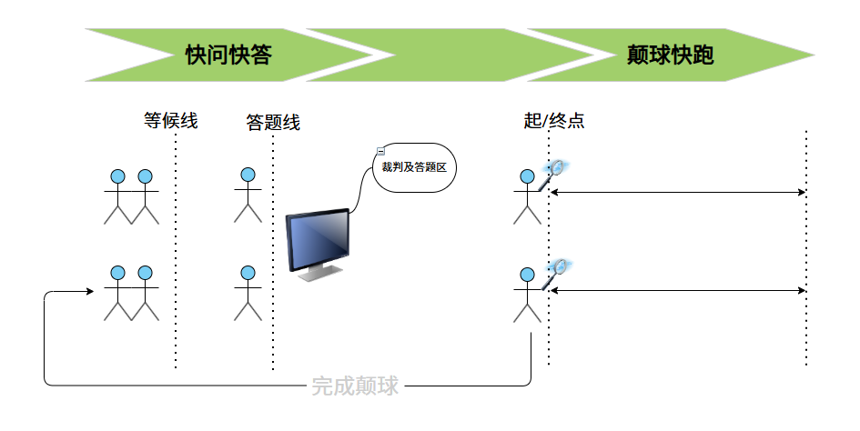
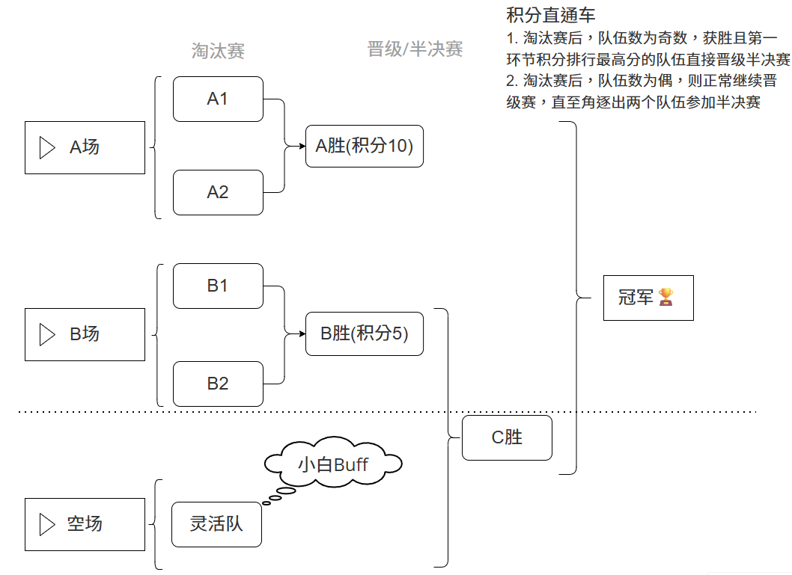

# 羽球活动

事件优先级说明
- 🔴 高优先级 / 紧急
- 🟡 中优先级 / 普通
- 🟢 低优先级 / 可延后

|待定情况|是否完成|优先级|
|:--|:--|:--|
|场地预定|⏳|🔴|
|随机分组名单，二维表格名单，以及记分名单|⏳|🟢|
|活动规则公示|⏳|🟢|
|征集羽毛球拍,至少8把，还有标签标识球拍|⏳|🔴|
|核准固定参加人员与灵活人员|⏳|🟡|

**总体时间轴**     
- 12:40-12:50 公布随机分组名单
- 12:50-13:00 羽毛球场集合
- 13:00-13:15 [Part 1](#Part1) 趣味热场 (活动计分->决定选场选边优先权)
- 13:15-14:15 [Part 2](#Part2) 羽毛球比赛
- 14:15-14:30 [Part 3](#Part3) 冠军团与领导合影、给寿星颁发礼品、集体合照

## Part 1
> 目标: 迅速活动气氛、队内所有员工进行参与，产生**团体积分**，决定**对决队伍与选场选边**优先权。        
> 记分规则：团队积分 = 最高分+ 最低分 + 中位数分        
> 总时长: 15m (演示2m，活动: 10m，核分宣布: 3m)          

- 活动图示

- 规则说明
  1. 所有成员依次在等候线外📌**排队等候**
  2. 比赛开始，每队成员，依次前往答题线，裁判问完问题后，先举手示意，正常裁判会选定举手最快的成员答题，答对计1分，📌**抢答、答错或未答**不得分
  3. 回答完毕的成员，前往颠球快跑区，边颠球边跑步，完成一个来回的成员，可📌**重新**回到队伍中排队参与第一环节的问答
  4. 颠球要求，在两条虚线区间，❌**不允许**手触碰羽毛球，❌**不允许**羽毛球掉落地上，否则重新来过

## Part 2
> 目标：比赛第一，友谊第二，勇夺冠军🏆        
> 记分规则：每局11分，3局2胜，获胜进入下一局比赛          
> 总时长: 60m        
> 
- 🏸赛程图

- 赛程说明:
  1. 第一环节的积分决定着第二环节的📌**赛程**以及📌**特权**，根据第一环节积分排名顺序，依次选择📌**对决队伍及选场选边**
  2. 赛前会指定俩名熟悉规则的成员作为俩个场地的**主裁**(主裁上场可指定其他熟悉规则的成员临时升级为**辅助裁判**)
  3. 对战每局11分，3局2胜制，交替平分需连追2分，期间未拉开2分差距的，优先得分至15分的队伍获胜
## Part 3
> 目标：完美收官生日会    
> 总时长：15m    

- 冠军团与领导合影留念
- 领导给寿星颁发生日礼品
- 所有成员集体合照
---
完美收官
